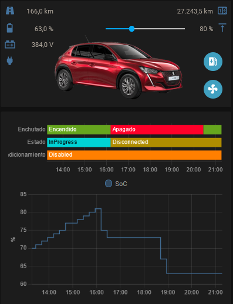
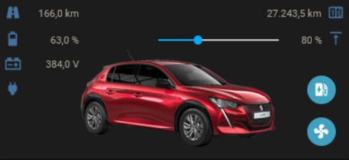
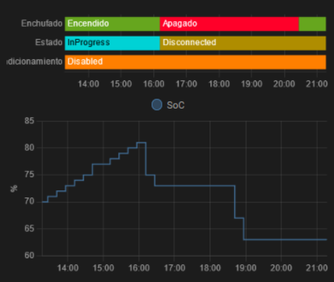

# Presentación
En esta guía se explica como controlar nuestro vehículo eléctrico del grupo Stellantis, usando PSA Car Controller (PSACC) integrado en Home Assistant (HA) y con la que se puede obtener un resultado parecido a esto:



***si, habeis observado bién, hay un porcentaje de tope de carga, al final es el objetivo de todo este lío, ya que Stellantis no se ha molestado en programar esta función*

[Home Assistant](https://www.home-assistant.io/) es una aplicación domótica muy popular, que se instala en un ordenador como un servidor web -accedemos a ella con el navegador- y tiene una app gratuita para móviles (Android y Iphone). Para su instalación y uso hay cientos de video tutoriales en youtube. Estos canales en español os pueden ser útiles:
* [Domótica Solar](https://www.youtube.com/c/Dom%C3%B3ticaSolar)
* [Un loco y su tecnología](https://www.youtube.com/channel/UC2zp7AWsYhZaGmYTjP8hZ7A)

[PSA Car Controller](https://github.com/flobz/psa_car_controller) es otra aplicación gratuita que se instala como un servidor web, la cual se comunica con los servidores de Stellantis para obtener información de nuestro vehículo y su estado, así como enviar algunas órdenes a nuestro vehículo. Lo hace simulando algunas de las funciones avanzadas y robustas de la aplicación MyPeugeot, MyCitroen, ....

***Aviso*
Los servidores de Stellantis tienen muchas limitaciones, sobretodo en la API B2C (*business to customer*) por lo que hay que tener en cuenta que:
* El servicio a veces se interrumpe sin saber exactamente el motivo (esto también pasa con la app de Stellantis), por mantenimiento programado o por que la infraestructura es muy pequeña y cae.
* Si se envían demasiadas órdenes o solicitudes del estado del vehículo, se aplican limitaciones de uso temporal y bloquean el acceso durante unas 48h.
* Algunas veces parece estar todo bién en los servidores de Stellantes, pero el vehículo no responde. Puede ser porque se haya con mala cobertura móvil (en un garaje en un sótano por ejemplo) o porque hay problemas en el vehículo.
* Cualquier día dejan de ofrecer este acceso de forma gratuita o la aplicación PSA CC deja de ser compatible con el servicio porque Stellantis ha decidido actualizar su aplicación para el móvil y han eliminado la API B2C antigua.
* El sistema al final no es 100% fiable y algún día os podeis encontrar el coche cargado más de lo programado. Por ejemplo en unos 6 meses de uso me ha ocurrido 2 veces, una por haber excedido yo el límite de uso (ya no me ha vuelto a pasar porque lo he limitado a actualizaciones cada 15 minutos), otra porque los servidores de Stellantis no estaban disponibles.
* Por todo ello, es recomendable disponer de una vía alternativa para regular el % de carga al detectar problemas con el PSA CC.

# Instalar Home Assistant
Si no lo tenéis claro como empezar:
[1000 opciones para planificar la instalación de Home Assistant… - Un loco y su tecnología](https://www.youtube.com/watch?v=OKG6nkYCSZs)
### [En una Raspberry Pi](https://www.home-assistant.io/installation/raspberrypi#install-home-assistant-operating-system)
* Menor consumo eléctrico.
* Ya no son tan baratas de compra, pero sigue siendo la mejor opción para empezar con esto.
* Recomendado una model 4 con al menos 4GB de RAM.

### [Como máquina virtual](https://www.home-assistant.io/installation/windows#install-home-assistant-operating-system)
* En un ordenador que ya tengas funcionando las 24h, si te lo puedes permitir.
* Dedicar almenos 2GB de RAM, 4GB recomendados, 32GB de disco duro y 2 vCPUs.
* Puedes usar [VirtualBox](https://www.virtualbox.org/wiki/Downloads) que es gratuito.

### [En cualquier máquina Linux con Docker](https://www.home-assistant.io/installation/linux#install-home-assistant-supervised)
[Instalar HOME ASSISTANT SUPERVISOR con DOCKER - Un loco y su tecnología](https://youtu.be/PGGUWlTVla8)

El método Supervised (con el Supervisor) sirve para instalar HA:
* Si conoces la línea de comandos de Linux o no te da miedo meterte al lío. Deduzco que es así si ya teneis esta máquina funcionando.
* En cualquier máquina con al menos 2GB de RAM y un par de nucleos, con Linux y docker ya instalados, a la que tengas acceso root (sudo) por SSH o un monitor y conexión a Internet.
* En un micro ordenador barato: un mini PC de segunda mano, una Raspberry Pi que ya tengais o cualquiera de las alternativas que hay más baratas y más disponibles.
* En un servidor en la nube (VPS).
	* En [Oracle Cloud Free Tier](https://www.oracle.com/es/cloud/free/) hay opciones gratuitas válidas. No cojas nada extra, no es necesario y después del periodo de prueba de 30 días pasarán a cobrarlo.
	* Las ventajas son que no gastamos nada, ni en comprar un ordenador, ni en electricidad las 24h.
	* Las desventajas son que no es nuestra infraestructura y no la controlamos, y que no podremos usar este HA por si solo para controlar dispositivos domóticos que tengamos en casa.
* Con solo 1GB va a funcionar, pero solo es recomendable en el caso que useis este ordenador única y exclusivamente para el PSACC. Si le das más usos, cuando se agote la RAM empezarás a tener cuelgues.

### Notas
* Importante: para hacer pruebas, instalar HA en una targeta SD es suficiente, pero para que sea algo que dure tiempo o usarlo de forma intensiva, se debe usar un disco duro SSD fiable, ya que una targeta SD tiene una vida útil muy limitada (número de escrituras) y es bastante común encontrarte que el ordenador se ha colgado y ya no arranca porque ha muerto la tarjeta SD.
* Los métodos Container o Core no sirven, ya que no se pueden añadir complementos que harán falta.
* Para evitar problemas al acceder, es recomendable poner una dirección IP fija en la máquina y usar esta dirección en vez de *homeassitant.local*.
* Recomiendo que el ordenador esté conectado por cable ethernet a la red.

# Pasos previos
* Hay que asegurarse que HA es accesible en un navegador. Por defecto hay que ir a http://homeassistant.local:8123 o bien http://ipfija:8123.
* Es necesario crear una cuenta que será el usuario administrador de HA.
* En el perfil de este usuario, accesible pulsando sobre el nombre de usuario una vez haya iniciada la sesión, o tecleando `cperfil`, hay que habilitar el modo avanzado.

# Copia de seguridad
Para los que ya tengais HA ya instalado, antes de tocar nada, o bien, una vez lo tengais todo configurado a vuestro gusto, hay que crear una copia de seguridad:
1. [Ajustes/Sistema/Copias de seguridad](http://homeassistant.local:8123/hassio/backups) o teclear `ccopias`.
2. Pulsar en **+ CREAR COPIA DE SEGURIDAD**.
3. Poner un nombre, seleccionar *Copia de seguridad completa* y pulsar **CREAR**.
4. Una vez creada la copia, pulsar sobre su nombre en la lista.
5. En el menú de 3 puntos seleccionar *Descargar* y se guardará en nuestro ordenador.

Parar restaurar la copia de seguridad:
1. Si no aparece en la lista, por ejemplo porque es una nueva instalación, hay que usar el botón 3 puntos al lado de *Copias de seguridad*, seleccionar *Subir copia de seguridad* y buscar el archivo préviamente descargado.
2. Una vez subida la copia, aparecerá en la lista, pulsar sobre el nombre.
3. Pulsar en **RESTORE**.

# Instalar complementos
1. Entraremos en [Ajustes/Complementos/Tienda de complementos](http://homeassistant.local:8123/hassio/store) o tecleando `ctienda`.
2. En la casilla *Search* introduce el nombre del complemento que quieres instalar.
3. Pulsas sobre el complemento a instalar.
4. Pulsas en **INSTALAR**.

### SSH & Web Terminal
Se usa para acceder a la línea de comandos.
1. En *Configuración* poner una contraseña en `password:` y pulsar **GUARDAR**.
2. Volver a *Información*, activar *Mostrar en la barra lateral*, *Iniciar en el arranque* y pulsar en **INICIAR**.

### File Editor
Permite editar los archivos de configuración *.yaml* de HA sin salir de HA. Activar *Mostrar en la barra lateral*, *Iniciar en el arranque* y pulsar en **INICIAR**. 

### Samba Share
Con este complemento, usando el explorador de archivos de tu ordenador puedes acceder a la configuración de HA, para editar o copiar archivos directamente.
1. En *Configuración* poner un usuario y contraseña en *Username* y *Password*. Pulsar en **GUARDAR**.
2. Volver a *Información*, activae *Iniciar en el arranque* y pulsae en **INICIAR**.

Para acceder usa la ruta `\\homeassistant.local` o `\\ipfija` .

### PSA Car Controller
Este complemento integra PSACC en HA. Para instalarlo primero hay que añadir el repositorio de PSACC a la tienda de complementos.
1. Pulsar en el menú tres puntos junto a *Tienda de complementos*.
2. Seleccionar *Repositorios*.
3. En la casilla *Añadir* poner `https://github.com/flobz/psacc-ha`. pulsar **AÑADIR** y luego **CERRAR**.
4. Recargar la página en el navegador.
5. Instalar ahora el complemento.

Una vez instalado, en la pestaña *Configuración*:
1. En *Red*, activar *Mostrar puertos deshabilitados* y escribir `5000` en el puerto *Web interface*, pulsar **GUARDAR**.
2. En *Opciones* escribir `--web-conf -c -r -R 15` en *PSACC_OPTIONS* y pulsar **GUARDAR**.
    * `--web-conf`: activar las opciones de configuración en la aplicación web de PSA CC.
    * `-c`: activar el control de carga.
    * `-r`: guardar datos del vehículo (trayectos, cargas, ...).
    * `-R 15`: actualizar el estado del vehículo cada 15 minutos. Con un tiempo menor, se sobrepasará el límite de servicio y los servidores de Stellantis nos bloquearan el acceso temporalmente.
    * `-d 10`: podeis añadir esta opción para mostrar en la ventana de registro (*Log*), información de los errores de comunicación con los servidores de Stellantis.

Volver a la pestaña Información, activar todas las opciones de inicio y pulsar **INICIAR**.

# PSA Car Controller
Entra en la aplicación desde la barra lateral de Home Assistant o directamente en una pestaña del navegador en http://homeassistant.local:5000 o http://ipfija:5000.

La primera vez mostrará el configurador para acceder a los datos del vehículo en los servidores de Stellantis. Una vez realizado este paso se mostrará toda la información registrada del vehículo. Para volver a acceder al configurador, pulsar en el icono del engranaje en la esquina superior derecha.

### User config
* *Car brand*: selecciona la marca de tu vehículo del desplegable.
* *Email* y *Password*: los mismos datos de registro de la cuenta Stellantis (MyPeugeot, ...) y usados en la app del móvil.
* *Country Code*: ES para España.

Pulsar en *Submit*. Pasados unos instantes nos dirá si todos es correcto.

Esta configuración ya no habrá que volver a hacerla, a no ser que cambiemos de vehículo o cuenta.

### OTP config
Esta configuración da acceso a los datos del vehículo temporalmente y hay que volver a realizarla cada cierto tiempo, parece ser que 1 vez al mes. Es parecido a cuando en la app del móvil se solicita el PIN.

Primero pulsar *Send SMS*, que envía un SMS con un código de activación al número que registrado en la cuenta de Stellantis. Puede tardar 1 minuto, sinó seguramente ha fallado y hay que volver a pulsar *Send SMS*. Introducir el código recibido en *Enter code*, el PIN usado en la app en *Enter codepin* y pulsar *Submit*.

### My Car Info
Si todo es correcto, al volver a *My car info*, se muestran los últimos datos registrados del vehículo. Si en la pestaña *Control* se visualiza el porcentaje de la batería, aunque no esté actualizado, la configuración es correcta. En el resto de pestañas tardará un tiempo en ir acumulando datos.

De vez en cuando, el programa dejará de actualizar datos. Puede estar pasando que:
  1. La más probable, hay que renovar el acceso OTP (1 vez al mes suele suceder), volver a entrar en OTP config y repetir el proceso (no hace falta volver a entrar email y contraseña).
  2. Los servidores de Stellantis han caido o están en mantenimiento o han capado el acceso al api gratuito. Suele ser temporal, 2 o 3 días máximo.
# Instalar HACS
Usaremos HACS para añadir nuevas targetas y controles *custom* a la interfaz de HA. HACS o tienda de la comunidad para Home Assistant, es una integración que permite descargar de múltiples fuentes nuevas integraciones y complementos.

Esta integración requiere una cuenta (gratuita) en [Github](https://github.com), por lo que si no la tienes ya, debes registrarte.

El proceso de instalación es algo complejo:
1. En la línea de comandos, bien accediento al *Terminal* en la barra lateral, pegar con *MAYUSCULAS+INSERT*, o bién accediendo por SSH, pegar con el botón derecho:
`wget -O - https://get.hacs.xyz | bash -`
2. Ejecutaremos pulsando la tecla *INTRO* y esperaremos a que finalice.
3. Reiniciar Home Assistant, ejecutando `ha host reboot` en el terminal o tecleando `creiniciar` en otro lado.
4. Esperar a que HA se haya reiniciado.
5. Importante: limpiar la caché de vuestro navegador.
6. en [Ajustes/Dispositivos y servicios/Integraciones](http://homeassistant.local:8123/config/integrations) o tecleando `cintegraciones`, pulsar **+ AÑADIR INTEGRACIÓN**.
7. Buscar *HACS* y seleccionarlo.
8. Aceptar todas las condiciones de uso.
9. Copiar la clave que aparece.
10. Clickar en la url https://github.com/login/device e iniciar la sesión en github si no lo hemos hecho ya.
11. Pegar la clave.
12. Autorizar HACS a acceder a tus datos de github.
13. Si todo salió bién, cerrar la página de github.
14. Volver a HA y finalizar la integración de HACS.
### Añadir repositorios
Los nuevas funciones de interfaz se añaden descargandolos de repositorios en internet:
1. Pulsar en HACS en la barra lateral.
2. Seleccionar la pestaña *Interfaz*.
3. Pulsar **+ EXPLORAR Y DESCARGAR REPOSITORIOS**.
4. Buscar el repositorio y seleccionarlo de la lista.
5. Pulsar **DESCARGAR ESTE REPOSITORIO CON HACS**.
6. Seleccionar una versión específica, no usar *master*, para evitar que futuras actualizaciones rompan la funcionalidad actual.
7. Pulsar **DESCARGAR**.
8. Recargar la página del navegador. 

# Integrar PSACC en Home Assistant mediante sensores y scripts
Basado en https://github.com/Flodu31/HomeAssistant-PeugeotIntegration.
* Editaremos o añadiremos los archivos *.yaml* en la carpeta `config` de HA, bién usando el complemento *File Editor* en la barra lateral, o a través del explorador de archivos entrando en `\\homeassistant.local` o `\\ipfija`.
* Si es una instalación de HA nueva se pueden reemplazar los archivos ya existentes.
* Si es un HA que ya estaba funcionando, no reemplazar archivos ya existentes, incorporarles el nuevo contenido.
* ¡Ojo con las indentaciones! Los espacios al inicio de cada línea son importantes. No usar tabuladores. [Tutorial de yaml para principiantes](https://learnxinyminutes.com/docs/es-es/yaml-es/).

Puedes descargar la carpeta [config](config/) de este repositorio y encontrarás todos los archivos indicados a continuación.

### secrets.yaml
Se usa para guardar información a proteger de extraños, como usuarios y contraseñas, por lo que nunca envíeis una copia de este archivo o una copia de seguridad de HA sin antes borrar la información.
```
mycar_vin: VIN12345678901234
mycar_baseurl: http://homeassistant.local:5000
```
Reemplazar los valores con vuestros datos. Para acceder a PSACC es preferible hacerlo con una dirección IP fija.

### binary_sensor.yaml
### input_text.yaml
### light.yaml
### rest_command.yaml
### sensor.yaml
### scripts.yaml
Contienen los sensores y scripts que integran los datos y órdenes del vehículo.

### python_scripts/set_state.py
En la carpeta `config` crear la carpeta `python_scripts` si aún no existe y copiar el archivo `set_state.py` dentro.

### configuration.yaml
Es el archivo de configuración inicial de HA.
Contenido a añadir:
```
python_script:
binary_sensor: !include binary_sensor.yaml
input_text: !include input_text.yaml      
light: !include light.yaml
rest_command: !include rest_command.yaml
sensor: !include sensor.yaml
```
Si ya aparece alguna de estas integraciones, hay que decidir si mover su configuración a un archivo yaml con `!include nombre_archivo.yaml`, o copiar el contenido del archivo yaml descargado al archivo *configuration.yaml*. Siempre respetando la nueva indentación.

Cada vez que se modifica un archivo yaml hay que verificar que no hay errores de formato o configuración.
1. Ir a [Herramientas para desarrolladores/YAML](http://homeassistant.local:8123/developer-tools/yaml).
2. Pulsar **VERIFICAR CONFIGURACIÓN**.
3. Si la configuración es válida, pulsar **REINICIAR**.
4. Si hay errores, corregirlos antes de reiniciar o es posible que HA no pueda volver a arrancar.
5. Una vez ha reiniciado, Ir a [Herramientas para desarrolladores/Estados](http://homeassistant.local:8123/developer-tools/state).
6. Filtrar estados con *mycar*. Aquí se puede ver si HA está actualizando el estado del vehículo desde PSACC. En caso contrario aparecerán sensores con valor `unavaliable`. 
# Panel de visualización Lovelace
Este es el paso final, que es añadir una o más tarjetas en la inferfaz de usuario de HA (*Lovelace*). Para añadir una tarjeta:
1. Si la tarjeta lo indica, añadir los repositorios necesarios con *HACS/Interfaz*.
2. Los enlaces 
3. Ir al panel de *Lovelace*.
4. En el menú tres puntos seleccionar *Editar panel de control*.
5. En la vista deseada, pulsar **+ AÑADIR TARGETA**.
6. Bajar al final de la lista y pulsar **MANUAL**.
7. Pegar el código yaml de la tarjeta.
8. Pulsar **GUARDAR**.

# Tarjetas
## @ivnbrvsnchz
<table>
<tr><td colSpan=3>Visualización comptacta con iconos que cambian según el estado del vehículo, barra de desplazamiento para ajustar el tope de carga, pausar/reanudar carga y iniciar/parar climatización</td></tr>
<tr><td colSpan=3></td></tr>
<tr>
<td></img></td>
<td colSpan=2>tope de carga</td>
</tr>
<tr>
<td></img></td>
<td width="100%">suspende / reanuda la carga (actualmente no funciona en PSACC)</td>
<td nowrap>&#x1F49C;<b>cargando</b><br>&#x1F49A;<b>diferida</b></td>
</tr>
<tr>
<td></img></td>
<td colSpan=2>inicia / para climatización</td>
</tr>
<tr>
<td>HACS</td>
<td colSpan=2>
<a href="https://github.com/jcwillox/lovelace-paper-buttons-row">Paper Buttons Row</a>
<br>
<a href="https://github.com/thomasloven/lovelace-card-mod">card-mod</a>
<br>
<a href="https://github.com/thomasloven/lovelace-slider-entity-row">slider-entity-row</a>
</td>
</tr>
<tr>
<td></img></td>
<td colSpan=2>
<a href="tarjetas/0001@ivnbrvsnchz/0001@ivnbrvsnchz.yaml">YAML</a><br>
<a href="tarjetas/0001@ivnbrvsnchz/e208.png">e208.png</a><br>
Guardar una imagen del vehículo en <i>config/www/mycar.png</i>
</td>
</tr>
</table>

<table>
<tr><td colSpan=3>Histórico del porcentaje de la batería, cable enchufado, estado de carga y preacondicionamiento</td></tr><tr><td colSpan=3><tr><td colSpan=3></td></tr>
<tr>
<td></img></td>
<td colSpan=2 width="100%">
<a href="tarjetas/0002@ivnbrvsnchz/0002@ivnbrvsnchz.yaml">YAML</a><br>
</td>
</tr>
</table>
